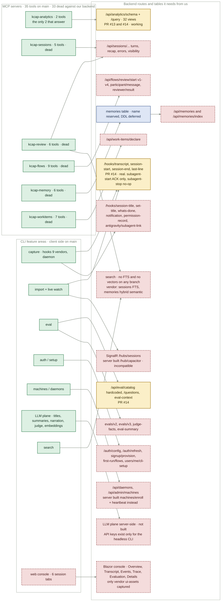
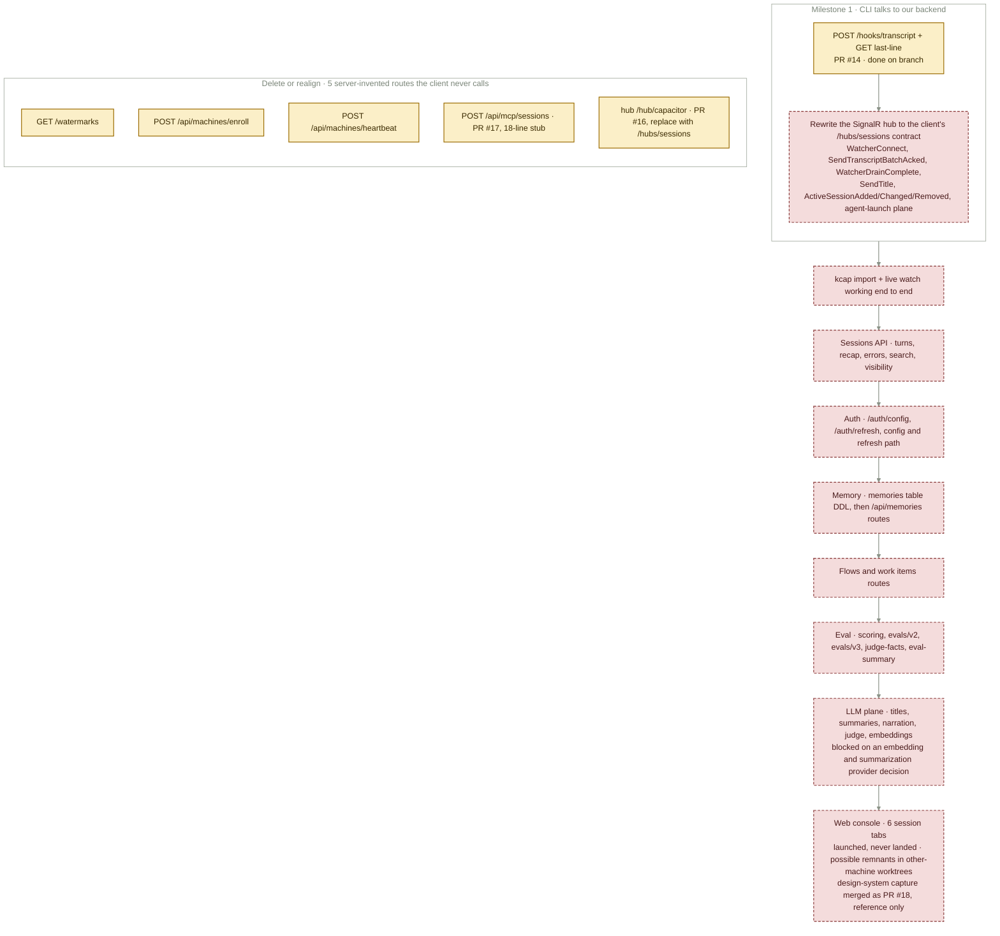

# Capacitor Replication Map

Frozen public artifact, inspected 2026-08-29:
[claude.ai artifact](https://claude.ai/code/artifact/4a6ed393-4991-4d62-9835-4e578a67cce8).
This file is that document. It is not the live map.

The server rebuild is roughly 15–20% done — and that already counts every open PR. Merging them advances nothing; they are the 15–20%. About 80% remains unbuilt.

Repo MooseGooseConsulting/capacitor, a private derivative of kurrent-io/kcap-cli. Deepest server branch: `origin/feat/schema-wave-9-mcp` — branches are cumulative. Nothing server-side is merged to main except docs; the README on main still says “Nothing new built yet.” Inspected 2026-08-29.

**STATES**

| Mark | Name | Meaning |
| --- | --- | --- |
| ● | MERGED | on main |
| ◐ | IN PR | open, unmerged |
| ○ | SPEC ONLY | documented, no code |
| × | NOT PLANNED / ABSENT | nothing anywhere |

---

## DIAGRAM A

The pipeline, end to end.

Every stage from the agent’s hook to the browser, coloured by where its code actually lives. Amber is the whole server rebuild: it sits in nine open PRs on one cumulative branch.

```mermaid
flowchart LR
  H["Hooks and CLI · 9 vendors<br/>on main · inherited, real, works vs vendor server"]:::merged
  T["POST /hooks/transcript<br/>PR #14 · real, with last-line watermark"]:::inpr
  I["Ingest · positioned idempotent store<br/>PR #11 · real"]:::inpr
  N["Normalizers · Claude, ACP, Antigravity<br/>PR #12 · real, 3 of the client's 9 live vendors"]:::inpr
  S["Canonical schema · 14 tables<br/>spec on main, entities in PR #10 · 905 lines"]:::inpr
  P["Postgres<br/>PR #15 · thin, ~470 lines"]:::inpr
  A["Analytics · 32 views<br/>PR #13 · real, views plus allowlist"]:::inpr
  X["HTTP API<br/>PR #14 · real but 11 of ~40 routes"]:::inpr
  R["SignalR live watcher<br/>PR #16 · stub 31 lines, WRONG contract, cannot connect"]:::inpr
  M["MCP tools · 35 in 6 servers<br/>on main · 33 of 35 dead, backing routes absent"]:::merged
  W["Web console · 6 session tabs<br/>launched, never landed · no web project on any branch"]:::absent

  H --> T --> I --> N --> S --> P --> A --> X --> R --> M --> W

  classDef merged fill:#DDF0E3,stroke:#2F7D4F,stroke-width:1.5px,color:#12301F
  classDef inpr fill:#FBEFC8,stroke:#9A6B00,stroke-width:1.5px,color:#3A2A00
  classDef spec fill:#DEE6F5,stroke:#3F5B8F,stroke-width:1.5px,color:#1B2B4A
  classDef absent fill:#F4DCDC,stroke:#8A3B3B,stroke-width:1.5px,stroke-dasharray:5 3,color:#4A1B1B
  linkStyle default stroke:#8A9287,stroke-width:1.5px
```

Green at both ends is inherited client code. Everything between is unmerged.

Two of the eleven stages are green, and both were inherited rather than built: the CLI/hook layer and the MCP tool layer. The nine amber stages are the entire server, and their depth varies by an order of magnitude — PR #10 is 905 real lines of entities and migrations, PR #16 is a 31-line stub that answers a contract the client does not speak.

The chain is only as connected as its thinnest link. Today the live path breaks at the watcher: the client dials `/hubs/sessions` and the server exposes `/hub/capacitor` with entirely different methods, so the watcher never connects and nothing streams.

### OPEN PRS BY WAVE

- **#10** wave 2 — Server.Data, entities/migrations, 905 lines, real
- **#11** wave 3 — Server.Ingest, position-addressed idempotent event store, real
- **#12** wave 4 — Server.Normalizers: Claude, Universal ACP, Antigravity, real
- **#13** wave 5 — Server.Analytics, 32 views + allowlist, real
- **#14** wave 6 — Server.Api gateway + eval catalog, real but 11/40 routes
- **#15** wave 7 — Postgres persistence, thin, ~470 lines
- **#16** wave 8 — SignalR hub `/hub/capacitor`, 31-line stub, wrong contract
- **#17** wave 9 — MCP cluster gateway `/api/mcp/sessions`, 18-line stub, client never calls it

Also unmerged: `wip/backup-all-work` — CLI-side harness auth, session-start memory, ui-assets capture.

---

## DIAGRAM B

What the client asks for, and what answers.

Left: the six MCP servers and the CLI feature areas, all merged and working — against the vendor’s server. Right: the backend each one needs from us. Only the analytics pair is answered.

33 of 35 MCP tools are dead against our backend. Only kcap-analytics answers.

The left column is not work remaining — it is inherited and battle-tested. That is what makes the picture deceptive: kcap works perfectly on this machine today, because it is talking to the vendor’s server. Point it at ours and 33 of 35 tools go dark, the watcher will not connect, and nothing but analytics answers.

Search is the one gap with no partial credit anywhere: no full-text index, no vector index, on any branch. The vendor does sessions with FTS and memories with hybrid semantic search, so replicating it forces a provider decision we have not made.

### FEATURE AREAS, PLAINLY

- **Capture** — client done; transcript and session start/end on branch; subagent linkage stub; titles, whats-done, notification, permission missing.
- **Live watcher** — contract mismatch, not working.
- **Schema + normalizers** — on branch, 3 vendors; upstream kcap has ~9.
- **Postgres** — thin on branch.
- **Analytics** — on branch, working.
- **Sessions API** — missing.
- **Search** — none of any kind.
- **Memory** — DDL deferred, routes missing.
- **Review flows, work items** — missing.
- **Eval/judge** — catalog + context on branch, catalog hardcoded; scoring, history, judge-facts missing.
- **Auth, org, workspace, signup** — missing; client runs on the unauthenticated escape hatch.
- **Machines/daemons** — server built different routes than the client calls.
- **LLM plane** — not built server-side.
- **Web console** — absent.
- **Multi-machine fleet** — spec only, fleet architecture refs in PR #8.

---

## DIAGRAM C

What has to happen, in order.

A dependency chain, not a menu. The first milestone is small and is the one that de-risks everything after it: make the CLI talk to our backend.

Milestone 1 is two items, one of them already done. The rest is the ~80%.

**Milestone 1 — CLI talks to our backend.** `/hooks/transcript` and last-line are done on the branch. The remaining piece is rewriting the SignalR hub to the client’s `/hubs/sessions` contract. PR #16 is not a starting point for that; it answers a different contract.

- kcap import + live watch working against the local server.
- Sessions API — turns, recap, errors, search, visibility.
- Auth — `/auth/config` and `/auth/refresh`.
- Memory — the DDL first, since it is deferred, then the routes.
- Flows and work items routes.
- Eval — scoring and judge-facts, on top of the catalog and context already on branch.
- LLM plane — and it cannot start until an embedding and summarization provider is chosen.
- Web console — six session tabs. Launched once and never landed; the only merged artefact is the design-system capture in PR #18. See Web console whereabouts below.

Separately, five routes on the branch exist because the server invented them, not because anything calls them: `GET /watermarks`, `POST /api/machines/enroll`, `POST /api/machines/heartbeat`, `POST /api/mcp/sessions`, and the hub `/hub/capacitor`. Delete them or realign them onto what the client actually calls — `/api/daemons`, `/api/admin/machines`, `/hubs/sessions`.

---

## WAVE GATES, FOR REFERENCE

1. Contract document exists; three probe sessions captured input-and-output; unknown-vendor behaviour known, not assumed.
2. kcap import against the local server completes and last-line reports the right watermark. The two halves are connected.
3. For one real Claude session, turns and events match kcap’s — turn count, per-turn tool counts, token totals, event ordering.
4. Three vendors normalized end to end, live capture working, and the feature cut approved by the operator.
5. Open a session you captured yourself and read it.
6. A coding agent kcap cannot record, recorded.

WAVES.md marks the sequence itself as a weak guess and the gates as strong. The gate that matters right now is gate 2, and it is not met.

---

## ROUTE LEDGER

Every endpoint the client calls.

About 40 endpoints, measured against the deepest branch. Eleven answer — all of them in open PRs, none on main. The rest do not exist.

| Endpoint | State | Note |
| --- | --- | --- |
| **CAPTURE & HOOKS** | | |
| POST /hooks/session-start/{vendor} | ◐ IN PR | PR #14 |
| POST /hooks/session-end/{vendor} | ◐ IN PR | PR #14 |
| POST /hooks/transcript | ◐ IN PR | the main ingestion route |
| GET /api/sessions/{id}/last-line | ◐ IN PR | watermark for resume |
| POST /hooks/subagent-start | ◐ IN PR | ACK only |
| POST /hooks/subagent-stop | ◐ IN PR | no-op |
| /hooks/session-title | × ABSENT | |
| /hooks/set-title | × ABSENT | |
| /hooks/whats-done | × ABSENT | |
| /hooks/notification | × ABSENT | |
| /hooks/permission-record | × ABSENT | |
| /hooks/antigravity/subagent-link | × ABSENT | |
| **LIVE WATCHER** | | |
| SignalR /hubs/sessions | × ABSENT | server has /hub/capacitor with JoinSessionGroup / JoinRepoGroup / JoinMachineGroup — incompatible, watcher cannot connect |
| **ANALYTICS** | | |
| GET /api/analytics/schema | ◐ IN PR | 32 views |
| POST /api/analytics/query | ◐ IN PR | allowlist governor |
| **EVAL & JUDGE** | | |
| GET /api/eval/catalog | ◐ IN PR | hardcoded |
| GET /api/eval/questions | ◐ IN PR | |
| GET /api/sessions/{id}/eval-context | ◐ IN PR | |
| GET /api/sessions/{id}/evals/v2 | × ABSENT | |
| GET .../evals/v3 | × ABSENT | |
| GET .../judge-facts | × ABSENT | |
| GET .../eval-summary | × ABSENT | |
| **SESSIONS READ & SEARCH** | | |
| GET /api/sessions/{id}/turns[/{i}] | × ABSENT | |
| GET .../recap | × ABSENT | |
| GET .../errors | × ABSENT | |
| PUT .../visibility | × ABSENT | |
| GET/POST /api/sessions/search | × ABSENT | no FTS or vector index anywhere |
| GET /api/attachments/{id} | × ABSENT | |
| **PROJECTS & REPOSITORIES** | | |
| GET /api/projects | × ABSENT | |
| GET /api/repositories/ | × ABSENT | |
| GET /api/repositories/{id}/skills | × ABSENT | |
| **MEMORY** | | |
| memories table | ○ SPEC ONLY | name reserved in CANONICAL-SCHEMA-SPEC.md, DDL deferred |
| GET/POST /api/memories[/index] | × ABSENT | |
| **FLOWS & WORK ITEMS** | | |
| POST /api/flows/review/start{,/v2,/v3,/v4} | × ABSENT | |
| POST .../participant/message | × ABSENT | |
| POST .../reviewer/result | × ABSENT | |
| POST /api/work-items/declare | × ABSENT | |
| **AUTH, ORG & ONBOARDING** | | |
| GET /auth/config | × ABSENT | client runs on the unauthenticated escape hatch |
| POST /auth/refresh | × ABSENT | |
| POST /api/signup/provision | × ABSENT | |
| POST /api/first-run/flows | × ABSENT | |
| POST /api/users/me/cli-setup | × ABSENT | |
| **MACHINES & DAEMONS** | | |
| GET /api/daemons | × ABSENT | |
| GET/POST /api/admin/machines | × ABSENT | server built enroll/heartbeat instead |
| **PRODUCT SURFACE** | | |
| GET /api/me/notification-prefs | × ABSENT | |
| POST /api/feedback | × ABSENT | |
| POST /api/agent-runs/{id}/events | × ABSENT | |
| **SERVER-INVENTED — THE CLIENT NEVER CALLS THESE** | | |
| GET /watermarks | ◐ IN PR | delete or realign |
| POST /api/machines/enroll | ◐ IN PR | delete or realign |
| POST /api/machines/heartbeat | ◐ IN PR | delete or realign |
| POST /api/mcp/sessions | ◐ IN PR | PR #17, 18-line stub |
| hub /hub/capacitor | ◐ IN PR | PR #16, replace with /hubs/sessions |

11 implemented on branch, ~29 missing — PR #14 covers 11 of ~40 routes.

---

## SETTLED

Decisions already made.

Four calls, and one still open.

**Store.** Postgres, not KurrentDB. An append-only positioned events table covers streams, subscriptions and projections at this scale.

**Eval.** Stays a core primitive — decision documented in PRs #20 and #21, merged to main.

**Memory.** DDL deferred. `memories` is a reserved name in the canonical schema spec, nothing more.

**Search.** Still open, and it blocks work. There is no search of any kind — no FTS, no vectors — on any branch. The vendor does sessions with FTS and memories with hybrid semantic search, so the replica has to pick an embedding provider before it can match that.

### ALSO ON RECORD

The canonical schema spec covers 14 tables; the analytics spec covers 32 views. Both are merged to main as documents.

Multi-machine fleet is spec only — architecture references live in PR #8.

Normalizers on branch cover Claude, Universal ACP and Antigravity. Upstream kcap normalizes about nine vendors.

---

## ACCOUNTING

Where the hours went.

The enumeration work is real, and it is merged. SURFACE.md is a full inventory of the kcap surface — CLI, routes, views, hub, the six console tabs, and a “what’s left” table. WAVES.md defines six gated waves. WIRECRAFT-MAPPING.md maps wire fields to schema fields. VENDOR-README.md and the reference/ui-assets capture — the vendor’s CSS, fonts and icons — are on main too. That is genuine, reusable work and it is why the route ledger above could be written at all.

What did not exist until now is the status column against it. The inventory said what kcap has; nothing said what we have. That is the gap this page closes, and it is why the project read as “almost done.”

The cheapest way to keep it closed: add an implemented | partial | missing column to SURFACE.md §4’s route list, and refresh it with every PR.

### Web console whereabouts — resolved

Both sessions ran on the other machine, `C:\_projects\capacitor`, on 2026-08-28.

**PR #18.** Merged. A Claude-in-Chrome capture of the vendor console’s design system — CSS tokens, icons, frozen HTML of all six detail tabs. Reference only, no runnable code.

**Session 1ca6b3c1.** Chose Blazor Server + MudBlazor and launched 8 parallel build agents — console shell, list and detail, plus 5 API endpoint modules — into agent worktrees under `.claude\worktrees\agent-*`. The session hit its usage limit before the results were collected. Nothing wired, nothing committed to a named branch, nothing pushed.

**Check first.** On the other machine, in `C:\_projects\capacitor`: `git worktree list` and `git branch --list 'agent-*'`. Any console code that survives is there.

---

## MERGED TO MAIN

- Inherited upstream client: CLI with 34 groups / 67 leaf commands, hooks for 9 vendors, daemon, 6 MCP servers with 35 tools, desktop app
- docs/schema/CANONICAL-SCHEMA-SPEC.md — 14 tables
- ANALYTICS-VIEWS-SPEC.md — 32 views
- WIRECRAFT-MAPPING.md — wire to schema field map
- reference/SURFACE.md, WAVES.md, BACKLOG.md, VENDOR-README.md
- reference/ui-assets — captured vendor CSS, fonts, icons
- PR #8 fork-pivot, PR #9 schema spec, PRs #20 and #21 eval-as-core-primitive
- PR #18 docs/console-design-system-capture — the vendor console’s tokens, icons and frozen tab HTML. Reference, not code.

---

## BEFORE BUILDING THE 80%

The question the last session raised.

On 2026-08-28, while the server PRs were being rebased, a retrospective session (`2ecb16fd`) concluded that the C#/.NET server replication had hit “heavy maintenance friction, schema sprawl, Windows tooling friction” and proposed pivoting to the simpler agent-corpus design — raw archive first, vendor AgentsView’s parsers, no server rebuild. Nothing was decided; the two sessions driving the PRs ended the same morning — one on a usage limit, one waiting for a call on PRs #10–#17.

So the ~80% is not just unbuilt, it is unconfirmed. The three paths are: finish the replication as mapped above; keep only the capture side (Milestone 1) and put the canonical schema on top of AgentsView instead of a new server; or shelve the server PRs and fold the schema and analytics work into agent-corpus. The route ledger is the same under all three — what changes is who answers the routes.

---

## OPERATIONAL BLOCKERS ON RECORD

- 14 open PRs, 208 unresolved bot review threads (2026-08-28)
- GitHub Actions billing-blocked; self-hosted Linux runner needed clang + zlib1g-dev, never confirmed
- Two orchestrator sessions raced the same branch chain; one stopped to avoid a force-push collision
- Console build agents’ output never collected — same failure shape as subagent scratchpad loss

Compiled from repo and branch inspection, 2026-08-29. Every claim traces to capacitor-status-data.md, reference/SURFACE.md, or reference/WAVES.md. Percentages are estimates from that inspection, not measurements.
