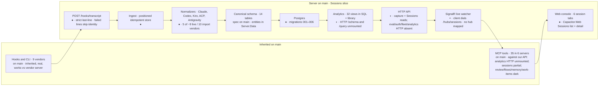
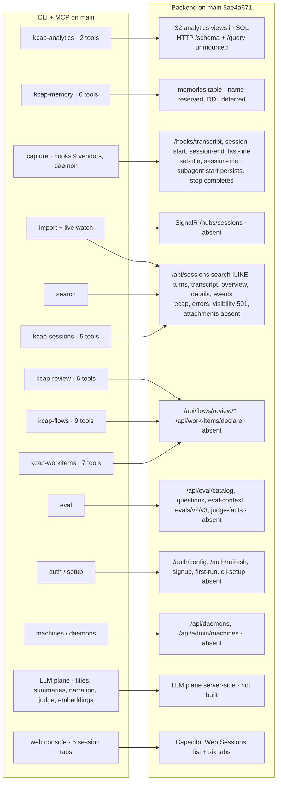
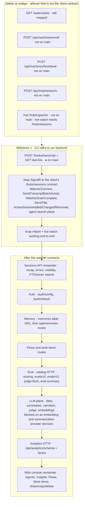

# Capacitor Replication Map

New copy of the 2026-08-29 map
([`REPLICATION-MAP-2026-08-29.md`](REPLICATION-MAP-2026-08-29.md);
[claude.ai artifact](https://claude.ai/code/artifact/4a6ed393-4991-4d62-9835-4e578a67cce8)).
The original is untouched. Facts here are from `origin/main` **`5ae4a671`**
(`feat(server): persist Sessions list and detail from captured events`).
Every claim traces to that tree, `reference/SURFACE.md`, or
`reference/WAVES.md`. Percentages in the original were estimates from
that inspection, not measurements; this copy does not invent a
replacement percentage.

Repo: MooseGooseConsulting/capacitor, a private derivative of
kurrent-io/kcap-cli. `main` carries the inherited CLI plus a Sessions
vertical slice (ingest, five normalizers, Postgres, HTTP, Blazor
console). Open PRs: none besides the PR that carries this file. Remote
`feat/schema-wave-*` branches still exist; they are not the authority
for what answers.

**STATES**

| Mark | Name | Meaning |
| --- | --- | --- |
| ● | MERGED | on `main` |
| ◐ | PARTIAL | on `main`, thinner than the client contract |
| ○ | SPEC ONLY | documented, no code |
| × | NOT PLANNED / ABSENT | nothing on `main` |
| — | CLOSED UNMERGED | existed on a wave branch / open PR; not in this tree |

---

## DIAGRAM A

The pipeline, end to end. Every stage from the agent’s hook to the
browser, coloured by where its code actually lives.

Green at the left end is inherited client code. Capture, ingest,
normalizers, schema, Postgres, and the Sessions console are on `main`.
The live path still breaks at the watcher: the client dials
`/hubs/sessions` and `Program.cs` maps no SignalR hub, so the watcher
never connects and nothing streams.

Two of the eleven stages are inherited rather than built here: the
CLI/hook layer and the MCP tool layer. MCP tools that need our backend
are only as live as the routes below. Analytics HTTP is unmounted, so
`kcap-analytics` is dark against this API even though 32 views exist in
SQL. Sessions tools that call `/search`, `/turns`, and `/transcript`
can answer; `get_session_summary` cannot (`/recap` absent).

The chain is only as connected as its thinnest link. Today that link is
the watcher.

### What the snapshot called “open PRs by wave”

Those PRs are not open. Status against `5ae4a671`:

| PR | Wave | Snapshot claim | Now |
| --- | --- | --- | --- |
| #10 | 2 | Server.Data, 905 lines | Closed unmerged. `Capacitor.Server.Data` is on `main` via #38. |
| #11 | 3 | Server.Ingest | Closed unmerged. Ingest is on `main`. |
| #12 | 4 | Claude, Universal ACP, Antigravity | **Merged.** Router also has Codex and Kiro. |
| #13 | 5 | 32 views + allowlist | **Merged** as library + `002_analytics_views.sql`. HTTP not mounted. |
| #14 | 6 | API gateway + eval catalog, 11/40 routes | **Closed unmerged.** Capture and Sessions reads landed in #38. Eval catalog HTTP did not. |
| #15 | 7 | Postgres, machines enroll/heartbeat | **Closed unmerged.** Postgres landed in #38 without those machine routes. |
| #16 | 8 | `/hub/capacitor` stub, wrong contract | **Closed unmerged.** No hub on `main`. Client still needs `/hubs/sessions`. |
| #17 | 9 | `POST /api/mcp/sessions` stub | **Closed unmerged.** Not mapped. |
| wip/backup-all-work | — | CLI harness auth, session-start memory, ui-assets | ui-assets landed as #18. The rest is not this file’s subject. |

Also merged after the snapshot: **#38** — Sessions persistence, HTTP,
and `Capacitor.Web`, with a recorded browser walkthrough.

---

## DIAGRAM B

What the client asks for, and what answers.

Left: the six MCP servers and the CLI feature areas, all merged and
working — against the vendor’s server. Right: the backend each one
needs from us.

The left column is not work remaining — it is inherited and
battle-tested. `kcap` works on this machine today because it is talking
to the vendor’s server. Point it at ours and the watcher will not
connect, analytics HTTP will not answer, and review / flows / memory /
work-items stay dark. Sessions search and turns can answer. Eval HTTP
is unmounted.

Search is substring `ILIKE` on title and event content.
`author_github_id` returns 501. There is no Postgres FTS and no vector
index. The vendor does sessions with FTS and memories with hybrid
semantic search, so matching that still forces a provider decision that
has not been made.

### FEATURE AREAS, PLAINLY

- **Capture** — client done; transcript, session start/end, last-line,
  set-title, session-title on `main`; subagent-start persists then ACKs;
  subagent-stop completes or 404s; whats-done, notification,
  permission-record, antigravity/subagent-link missing.
- **Live watcher** — contract absent, not working.
- **Schema + normalizers** — on `main`, five vendors (Claude, Codex,
  Kiro, Universal ACP, Antigravity). Upstream kcap has ~9 live / 10 import.
- **Postgres** — on `main`, migrations 001–006.
- **Analytics** — views and governor library on `main`; HTTP unmounted.
- **Sessions API** — list, detail, turns, transcript, events, overview,
  search ILIKE on `main`; recap, errors, attachments missing; visibility 501.
- **Search** — ILIKE only; no FTS, no vectors.
- **Memory** — DDL deferred, routes missing.
- **Review flows, work items** — missing.
- **Eval/judge** — `eval_runs` / `eval_verdicts` exist; Sessions detail
  can show a persisted run. Catalog, questions, scoring routes,
  history, and judge-facts missing from HTTP.
- **Auth, org, workspace, signup** — missing; client runs on the
  unauthenticated escape hatch.
- **Machines/daemons** — client still calls `/api/daemons` and
  `/api/admin/machines`; those routes are absent. Enroll/heartbeat
  are also absent.
- **LLM plane** — not built server-side.
- **Web console** — Sessions list + six detail tabs on `main`.
  Agents / Insights / Flows / Work items are visible and unavailable.
- **Multi-machine fleet** — spec only; architecture refs in PR #8.

---

## DIAGRAM C

What has to happen, in order. A dependency chain, not a menu. The first
milestone is still the one that de-risks everything after it: make the
CLI talk to our backend end to end, including live watch.

**Milestone 1** is two items, one of them done. Transcript and last-line
are on `main`. The remaining piece is mapping SignalR to the client’s
`/hubs/sessions` contract. There is no `/hub/capacitor` on this tree to
start from, and the closed PR #16 stub is not a starting point — it
answered a different contract.

- `kcap import` against the local server can complete (capture routes
  exist). **Live watch cannot.**
- Sessions API — turns and transcript exist; recap, errors, search
  beyond ILIKE, visibility do not.
- Auth — `/auth/config` and `/auth/refresh`.
- Memory — the DDL first, since it is deferred, then the routes.
- Flows and work items routes.
- Eval — catalog and scoring HTTP, on top of `eval_runs` / `eval_verdicts`.
- LLM plane — cannot start until an embedding and summarization
  provider is chosen.
- Analytics HTTP — mount the already-merged views behind the allowlist.
- Web console — six session tabs exist. Remaining chrome: Agents,
  Insights, Flows, Work items, share, copy-link, delete.

Separately, one route on `main` exists because the server invented it,
not because the client calls it: `GET /watermarks`. Delete it or
realign it. Enroll, heartbeat, `/api/mcp/sessions`, and `/hub/capacitor` are
absent from this tree. The client calls `/api/daemons`,
`/api/admin/machines`, and `/hubs/sessions`.

---

## WAVE GATES, FOR REFERENCE

1. Contract document exists; three probe sessions captured
   input-and-output; unknown-vendor behaviour known, not assumed.
2. `kcap import` against the local server completes and last-line
   reports the right watermark. The two halves are connected.
3. For one real Claude session, turns and events match kcap’s — turn
   count, per-turn tool counts, token totals, event ordering.
4. Three vendors normalized end to end, live capture working, and the
   feature cut approved by the operator.
5. Open a session you captured yourself and read it.
6. A coding agent kcap cannot record, recorded.

`WAVES.md` marks the sequence itself as a weak guess and the gates as
strong. Gate 2’s import half can pass; the live-watch half cannot until
`/hubs/sessions` exists. Gate 5 has a console and a recorded
walkthrough in `deploy/recovery/` (that job was not re-run in this
checkout). Gate 6 is unmet.

---

## ROUTE LEDGER

Every endpoint the client calls. Measured against `5ae4a671`. Capture
and Sessions reads answer. Analytics HTTP, eval HTTP, live watcher,
auth, fleet, memory, flows, and work-items do not.

| Endpoint | State | Note |
| --- | --- | --- |
| **CAPTURE & HOOKS** | | |
| `POST /hooks/session-start/{vendor}` | ● MERGED | also unprefixed `/session-start/{vendor}` |
| `POST /hooks/session-end/{vendor}` | ● MERGED | also unprefixed |
| `POST /hooks/transcript` | ● MERGED | `strict`; failed lines skip event identity |
| `GET /api/sessions/{id}/last-line` | ● MERGED | watermark for resume |
| `POST /hooks/subagent-start` | ● MERGED | persists the child session, then ACK |
| `POST /hooks/subagent-stop` | ● MERGED | completes the child or 404 |
| `/hooks/session-title` | ● MERGED | |
| `/hooks/set-title` | ● MERGED | |
| `/hooks/whats-done` | × ABSENT | |
| `/hooks/notification` | × ABSENT | |
| `/hooks/permission-record` | × ABSENT | |
| `/hooks/antigravity/subagent-link` | × ABSENT | |
| **LIVE WATCHER** | | |
| SignalR `/hubs/sessions` | × ABSENT | client: `WatcherConnect`, `SendTranscriptBatchAcked`, `WatcherDrainComplete`, `SendTitle`, `ActiveSessionAdded` / `Changed` / `Removed`. No hub mapped. Closed #16 was `/hub/capacitor` — incompatible with this contract. |
| **ANALYTICS** | | |
| `GET /api/analytics/schema` | × ABSENT | 32 views exist in SQL; this HTTP is unmounted |
| `POST /api/analytics/query` | × ABSENT | `GovernedSql` library exists; HTTP unmounted |
| **EVAL & JUDGE** | | |
| `GET /api/eval/catalog` | × ABSENT | |
| `GET /api/eval/questions` | × ABSENT | |
| `GET /api/sessions/{id}/eval-context` | × ABSENT | |
| `GET /api/sessions/{id}/evals/v2` | × ABSENT | |
| `GET .../evals/v3` | × ABSENT | |
| `GET .../judge-facts` | × ABSENT | |
| `GET .../eval-summary` | × ABSENT | |
| **SESSIONS READ & SEARCH** | | |
| `GET /api/sessions/{id}` | ● MERGED | header + events + trace + latest eval |
| `GET /api/sessions/{id}/overview` | ● MERGED | |
| `GET /api/sessions/{id}/details` | ● MERGED | |
| `GET /api/sessions/{id}/events` | ● MERGED | |
| `GET /api/sessions/{id}/transcript` | ● MERGED | |
| `GET /api/sessions/{id}/turns[/{i}]` | ● MERGED | |
| `GET .../recap` | × ABSENT | blocks `kcap-sessions` `get_session_summary` |
| `GET .../errors` | × ABSENT | |
| `PUT .../visibility` | ◐ PARTIAL | returns 501 |
| `GET/POST /api/sessions/search` | ◐ PARTIAL | GET ILIKE title + event content; `author_github_id` → 501; POST unmapped; no FTS or vectors |
| `GET /api/attachments/{id}` | × ABSENT | |
| **PROJECTS & REPOSITORIES** | | |
| `GET /api/projects` | × ABSENT | |
| `GET /api/repositories/` | × ABSENT | |
| `GET /api/repositories/{id}/skills` | × ABSENT | |
| **MEMORY** | | |
| `memories` table | ○ SPEC ONLY | name reserved in CANONICAL-SCHEMA-SPEC.md, DDL deferred |
| `GET/POST /api/memories[/index]` | × ABSENT | |
| **FLOWS & WORK ITEMS** | | |
| `POST /api/flows/review/start{,/v2,/v3,/v4}` | × ABSENT | |
| `POST .../participant/message` | × ABSENT | |
| `POST .../reviewer/result` | × ABSENT | |
| `POST /api/work-items/declare` | × ABSENT | |
| **AUTH, ORG & ONBOARDING** | | |
| `GET /auth/config` | × ABSENT | client runs on the unauthenticated escape hatch |
| `POST /auth/refresh` | × ABSENT | |
| `POST /api/signup/provision` | × ABSENT | |
| `POST /api/first-run/flows` | × ABSENT | |
| `POST /api/users/me/cli-setup` | × ABSENT | |
| **MACHINES & DAEMONS** | | |
| `GET /api/daemons` | × ABSENT | |
| `GET/POST /api/admin/machines` | × ABSENT | |
| **PRODUCT SURFACE** | | |
| `GET /api/me/notification-prefs` | × ABSENT | |
| `POST /api/feedback` | × ABSENT | |
| `POST /api/agent-runs/{id}/events` | × ABSENT | |
| **SERVER-INVENTED — THE CLIENT NEVER CALLS THESE** | | |
| `GET /watermarks` | ● MERGED | leftover; delete or realign |
| `POST /api/machines/enroll` | — CLOSED | was on wave 7; not on `main` |
| `POST /api/machines/heartbeat` | — CLOSED | was on wave 7; not on `main` |
| `POST /api/mcp/sessions` | — CLOSED | was PR #17 stub; not on `main` |
| hub `/hub/capacitor` | — CLOSED | was PR #16; not on `main`; replace with `/hubs/sessions` if building live watch |

---

## SETTLED

Decisions already made. Four calls, and one still open.

**Store.** Postgres, not KurrentDB. An append-only positioned events
table covers streams, subscriptions and projections at this scale.

**Eval.** Stays a core primitive — decision documented in PRs #20 and
#21, merged to main. `eval_runs` / `eval_verdicts` exist; Sessions
detail can include the latest run. Scoring HTTP is unbuilt.

**Memory.** DDL deferred. `memories` is a reserved name in the
canonical schema spec, nothing more.

**Search.** Still open for FTS and vectors, and that blocks matching
the vendor. This tree has ILIKE substring search on sessions. The
vendor does sessions with FTS and memories with hybrid semantic search,
so the replica has to pick an embedding provider before it can match
that.

### ALSO ON RECORD

The canonical schema spec covers 14 tables; the analytics spec covers
32 views. Both are merged to main as documents. The views also exist as
`002_analytics_views.sql`.

Multi-machine fleet is spec only — architecture references live in PR #8.

Normalizers on main cover Claude, Codex, Kiro, Universal ACP and
Antigravity. Upstream kcap normalizes about nine live vendors.

---

## ACCOUNTING

Where the hours went.

The enumeration work is real, and it is merged. `SURFACE.md` is a full
inventory of the kcap surface — CLI, routes, views, hub, the six
console tabs, and a “what’s left” table. `WAVES.md` defines six gated
waves. `WIRECRAFT-MAPPING.md` maps wire fields to schema fields.
`VENDOR-README.md` and the `reference/ui-assets` capture — the vendor’s
CSS, fonts and icons — are on main too. That is genuine, reusable work
and it is why the route ledger above could be written at all.

The 2026-09-04 copy is that status column against current `main`, pinned to
`5ae4a671`. `SURFACE.md` now carries implemented | partial | missing
on the wire-contract list; refresh both files with every PR that
changes a route.

### Web console whereabouts — resolved

Both sessions named in the snapshot ran on the other machine,
`C:\_projects\capacitor`, on 2026-08-28.

**PR #18.** Merged. A Claude-in-Chrome capture of the vendor console’s
design system — CSS tokens, icons, frozen HTML of all six detail tabs.
Reference only, no runnable code.

**Session 1ca6b3c1.** Chose Blazor Server + MudBlazor and launched 8
parallel build agents — console shell, list and detail, plus 5 API
endpoint modules — into agent worktrees under `.claude\worktrees\agent-*`.
The session hit its usage limit before the results were collected.
Nothing from those worktrees is this tree’s console.

**What landed.** `src/Capacitor.Web/` on `main` via #38: Sessions list,
six-tab detail (Overview, Transcript, Events, Trace, Evaluation,
Details), captured-event persistence. Agents / Insights / Flows / Work
items remain visible and unavailable. Share, copy-link, and delete are
disabled.

**Check first** if hunting the 2026-08-28 worktrees: on the other
machine, in `C:\_projects\capacitor`: `git worktree list` and
`git branch --list 'agent-*'`.

---

## MERGED TO MAIN

- Inherited upstream client: CLI with 34 groups / 67 leaf commands,
  hooks for 9 vendors, daemon, 6 MCP servers with 35 tools, desktop app
- `docs/schema/CANONICAL-SCHEMA-SPEC.md` — 14 tables
- `ANALYTICS-VIEWS-SPEC.md` — 32 views
- `WIRECRAFT-MAPPING.md` — wire to schema field map
- `reference/SURFACE.md`, `WAVES.md`, `BACKLOG.md`, `VENDOR-README.md`
- `reference/ui-assets` — captured vendor CSS, fonts, icons
- PR #8 fork-pivot, PR #9 schema spec, PRs #20 and #21 eval-as-core-primitive
- PR #18 `docs/console-design-system-capture` — the vendor console’s
  tokens, icons and frozen tab HTML. Reference, not code.
- PR #12 `Capacitor.Server.Normalizers`
- PR #13 `Capacitor.Server.Analytics` + `002_analytics_views.sql`
- PR #38 `Capacitor.Server.{Data,Ingest,Api}` + `Capacitor.Web` Sessions
  slice, Postgres migrations 001–006
- PR #19 / #22 — self-hosted CI runner (`.github/workflows`)

`README.md` on this SHA says a route on `main` is not a deployed
service, and names `capacitor_test` as the recovery database. It does
not say the server is unbuilt.

---

## BEFORE BUILDING WHAT REMAINS

The question the 2026-08-28 retrospective (session `2ecb16fd`) raised:
the C#/.NET server replication had hit “heavy maintenance friction,
schema sprawl, Windows tooling friction” and proposed pivoting to the
simpler agent-corpus design — raw archive first, vendor AgentsView’s
parsers, no server rebuild. Nothing in that session decided a pivot.

This tree has the C# server and Sessions console (#38). The product
cut in `PROMPT.md` is still the operator’s. The three paths remain:
finish the replication as mapped above; keep only the capture side
(Milestone 1, including live watch) and put the canonical schema on
top of AgentsView instead of a new server; or fold the schema and
analytics work into agent-corpus. The route ledger is the same under
all three — what changes is who answers the routes.

---

## OPERATIONAL BLOCKERS ON RECORD

Snapshot (2026-08-28): 14 open PRs, 208 unresolved bot review threads;
GitHub Actions billing-blocked; self-hosted Linux runner needed clang +
zlib1g-dev, never confirmed; two orchestrator sessions raced the same
branch chain; console build agents’ output never collected.

This checkout: GitHub Actions run on `[self-hosted, Linux]`
(`.github/workflows/ci.yml`). Open PRs besides this documentation
change: none. Wave branches `feat/schema-wave-6-api` through
`feat/schema-wave-9-mcp` remain on the remote and are not `main`.
Live-watch absence, unmounted analytics/eval HTTP, and the embedding
provider decision are the blockers that still govern what can be built
next.
