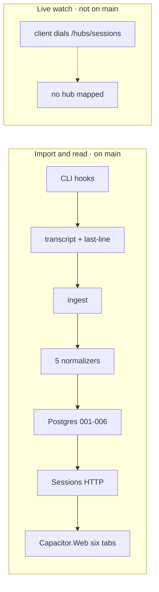

# What landed — Capacitor on `main`

Read this first. It is the status briefing at `origin/main` **`5ae4a671`**.
The August gap-analysis is frozen at
[`REPLICATION-MAP-2026-08-29.md`](REPLICATION-MAP-2026-08-29.md).
The route-by-route ledger is
[`REPLICATION-MAP-2026-09-04.md`](REPLICATION-MAP-2026-09-04.md).

## In one screen

Between 2026-08-28 and 2026-09-02 this repo went from “docs on `main`”
to a **Sessions vertical slice you can import and open in a browser**.

That is **#38** (squash, 8,285 lines, Blood Arrow browser job 8/8), on
top of **#12** (normalizers) and **#13** (analytics SQL + library).

Six assemblies that did not exist at the fork: `Capacitor.Server.Data`,
`Ingest`, `Normalizers`, `Analytics`, `Api`, and `Capacitor.Web` —
about 11k lines of server/web plus tests.

Two paths. Import → Postgres → HTTP → console **works on `main`**.
Live watch **does not**: the client dials `/hubs/sessions` and
`Program.cs` maps no SignalR hub. Closed **#16** built `/hub/capacitor`
with different methods; that is not a starting point.

Do **not** merge leftover wave or recover PRs. They are closed. Their
“ahead of main” counts are unsquashed hashes of work **#38** already
landed, or a stale stack that would put the wrong hub back. The only
open PR besides docs is none.

## What `main` answers

- Capture: session-start/end, transcript (`strict`), last-line, set-title,
  session-title. Subagent-start persists then ACKs; subagent-stop
  completes or 404s.
- Normalizers: Claude, Codex, Kiro, Universal ACP, Antigravity.
- Store: Postgres, positioned idempotent events, migrations 001–006.
- Sessions HTTP: list/detail, overview, details, events, transcript,
  turns, search (`ILIKE` on title and event content).
- Console: Sessions list + six tabs (Overview, Transcript, Events,
  Trace, Evaluation, Details). Agents / Insights / Flows / Work items
  are visible and unavailable.

## What it does not answer

- SignalR `/hubs/sessions` (live watch, daemon attach, agent-launch plane).
- Analytics HTTP (`/api/analytics/schema` + `/query`) — 32 views exist
  in SQL; the HTTP is unmounted, so `kcap-analytics` is dark.
- Eval catalog/scoring HTTP — `eval_runs` / `eval_verdicts` exist.
- `/recap`, `/errors`, `PUT visibility` (501), FTS/vector search.
- Auth (`/auth/config`, `/auth/refresh`), daemons, admin machines,
  memories, flows, work items, `/api/review/...`.
- `kcap-review` calls `/api/review/{owner}/{repo}/pulls/{n}` and
  `/api/review/sessions/.../transcript` — those routes are absent.
  Review is not the flows API.

Next build against **this** tree: map `/hubs/sessions` to the client
contract, then mount HTTP that already has SQL/libraries. Do not
reopen `#14`–`#17` or the recover PRs.

WAVES gate 2: import can complete; live watch cannot. Gate 5 has a
console and a recorded walkthrough in `deploy/recovery/` (not re-run
in the map checkout).
