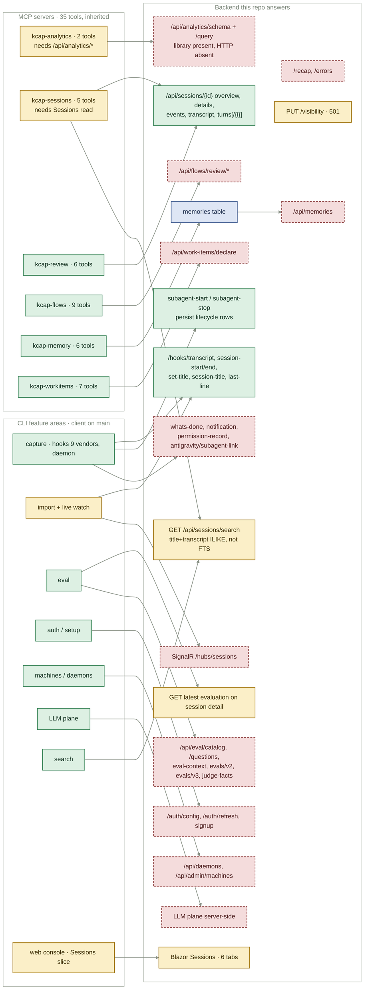
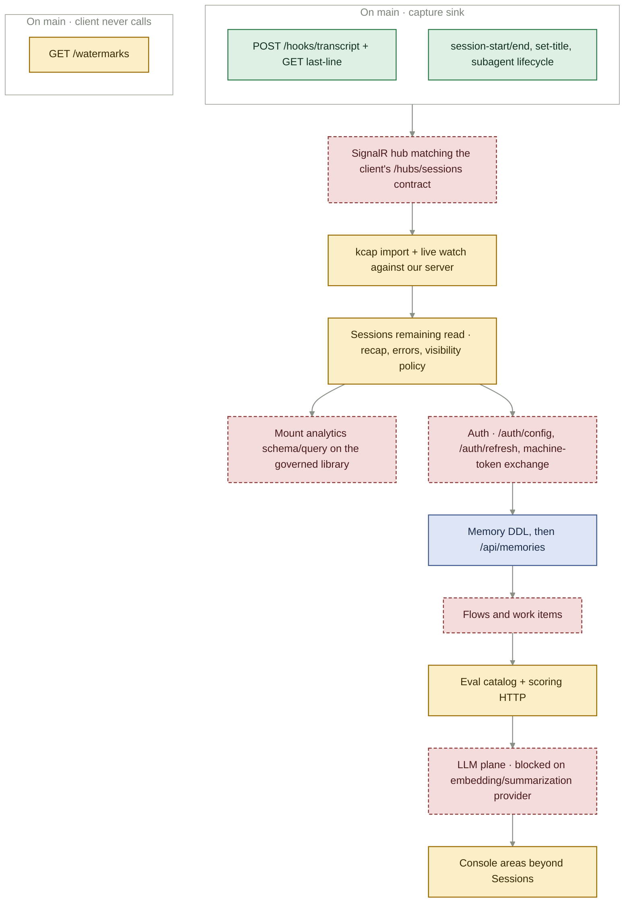

# Capacitor replication map

Pinned to `5ae4a671` on `main`. This file is the live map of what this
repository answers. The published Claude page at
`https://claude.ai/code/artifact/4a6ed393-4991-4d62-9835-4e578a67cce8` is a
snapshot of a 2026-08-29 branch inspection and is not authority.

States:

| mark | meaning |
|---|---|
| **MERGED** | on `main` |
| **PARTIAL** | on `main`, incomplete against the client contract |
| **SPEC** | documented, no handler |
| **ABSENT** | nothing on `main` |

Open pull requests: none. Closed unmerged PRs #14–#17 are not this map; #38
landed a Sessions-shaped API instead of those four patches.

A route on `main` is not a deployed service. Deployment claims still require a
fresh Blood Arrow inventory and a real import plus browser render against
`capacitor_test` — see `README.md`.

---

## The pipeline

```mermaid
flowchart LR
  H["Hooks and CLI · 9 live vendors<br/>inherited, works vs vendor server"]:::merged
  T["POST /hooks/transcript<br/>+ last-line watermark"]:::merged
  I["Ingest · position-addressed store<br/>source receipts, logical_seq"]:::merged
  N["Normalizers · Claude, Codex, Kiro,<br/>Universal ACP, Antigravity"]:::partial
  S["Canonical schema · Postgres migrations<br/>001–006 on main"]:::merged
  P["Postgres capture foundation"]:::merged
  A["Analytics library + 32 SQL views<br/>HTTP schema/query not mounted"]:::partial
  X["HTTP API · capture + Sessions read"]:::partial
  R["SignalR /hubs/sessions<br/>client still dials this"]:::absent
  M["MCP tools · 35 in 6 servers<br/>backing routes mostly absent"]:::partial
  W["Web console · Sessions 6 tabs<br/>other nav honestly unavailable"]:::partial

  H --> T --> I --> N --> S --> P --> A --> X --> R --> M --> W

  classDef merged fill:#DDF0E3,stroke:#2F7D4F,stroke-width:1.5px,color:#12301F
  classDef partial fill:#FBEFC8,stroke:#9A6B00,stroke-width:1.5px,color:#3A2A00
  classDef spec fill:#DEE6F5,stroke:#3F5B8F,stroke-width:1.5px,color:#1B2B4A
  classDef absent fill:#F4DCDC,stroke:#8A3B3B,stroke-width:1.5px,stroke-dasharray:5 3,color:#4A1B1B
  linkStyle default stroke:#8A9287,stroke-width:1.5px
```

Green at the left is inherited client code. The middle of the chain is now on
`main`: ingest, five normalizers, Postgres, and a Sessions HTTP+Blazor slice.
The live path still breaks at the watcher. The client dials `/hubs/sessions`
(`WatcherConnect`, `SendTranscriptBatchAcked`, …). No hub is mapped in
`Capacitor.Server.Api`.

`/hub/capacitor` is not on `main`. That wrong contract was never merged.

---

## What the client asks for, and what answers

kcap still works against the vendor server. Pointed at ours: capture and Sessions
read can answer; analytics MCP, live watch, auth, machines, flows, memory, and
work items cannot.

---

## Feature areas

| area | state |
|---|---|
| Capture | **PARTIAL.** Transcript, session start/end, titles, and subagent start/stop persist. `whats-done`, `notification`, `permission-record`, `antigravity/subagent-link` absent. |
| Live watcher | **ABSENT.** Client `/hubs/sessions` has no server hub. |
| Schema + normalizers | **PARTIAL.** Five vendors on `main` (Claude, Codex, Kiro, Universal ACP, Antigravity). Client import sources are ten; live harnesses are nine. |
| Postgres | **MERGED.** Capture foundation and migrations 001–006. |
| Analytics | **PARTIAL.** 32 views in SQL and a governed-SQL library. `/api/analytics/schema` and `/query` are not mapped. |
| Sessions API | **PARTIAL.** Detail, overview, details, events, transcript, turns. `recap` and `errors` absent. Visibility is 501. |
| Search | **PARTIAL.** `GET /api/sessions/search` matches title and event `content` with `ILIKE`. No FTS, no vectors. `author_github_id` is 501. |
| Memory | **SPEC.** Name reserved; no DDL and no routes. |
| Review flows, work items | **ABSENT.** |
| Eval / judge | **PARTIAL.** Session detail can render a persisted evaluation. Catalog, questions, eval-context, evals/v2, evals/v3, judge-facts, eval-summary HTTP absent. |
| Auth, org, signup | **ABSENT.** Client unauthenticated escape hatch (`auth_provider: null`). |
| Machines / daemons | **ABSENT.** `FLEET.md` still requires `/api/daemons` and `/api/admin/machines`. Session rows can store `machine_id`. |
| LLM plane | **ABSENT** server-side. |
| Web console | **PARTIAL.** `Capacitor.Web` Sessions list/detail with Overview, Transcript, Events, Trace, Evaluation, Details. Agents, Insights, Flows, Work items are visible and unavailable. Share / copy-link / delete disabled. |
| Multi-machine fleet | **SPEC**, with a machine column on the session header. |

---

## What has to happen, in order

The capture sink is on `main`. The remaining Milestone-1 hole is the watcher
hub. Import can post transcript batches without it; live watch cannot.

`GET /watermarks` is still mapped and is not a client call. Enroll, heartbeat,
`/api/mcp/sessions`, and `/hub/capacitor` are not on `main`.

---

## Route ledger

Measured against `src/Capacitor.Server.Api/Program.cs` at `5ae4a671`.

### Capture and hooks

| endpoint | state | note |
|---|---|---|
| `POST /hooks/session-start/{vendor}` | **MERGED** | also unprefixed `/hooks/session-start` |
| `POST /hooks/session-end/{vendor}` | **MERGED** | also unprefixed `/hooks/session-end` |
| `POST /hooks/transcript` | **MERGED** | honours `strict`; rejects failed lines without occupying the event identity |
| `GET /api/sessions/{id}/last-line` | **MERGED** | 200 / 204 / 404 |
| `POST /hooks/subagent-start` | **MERGED** | persists a subagent run, then ACKs |
| `POST /hooks/subagent-stop` | **MERGED** | completes the run or 404 |
| `POST /hooks/session-title` | **MERGED** | |
| `POST /hooks/set-title` | **MERGED** | |
| `/hooks/whats-done` | **ABSENT** | |
| `/hooks/notification` | **ABSENT** | |
| `/hooks/permission-record` | **ABSENT** | |
| `/hooks/antigravity/subagent-link` | **ABSENT** | |

### Live watcher

| endpoint | state | note |
|---|---|---|
| SignalR `/hubs/sessions` | **ABSENT** | client methods: `WatcherConnect`, `SendTranscriptBatchAcked`, `WatcherDrainComplete`, `SendTitle`, active-session plane, agent-launch plane |

### Analytics

| endpoint | state | note |
|---|---|---|
| `GET /api/analytics/schema` | **ABSENT** | SQL views exist in `002_analytics_views.sql`; HTTP not mapped |
| `POST /api/analytics/query` | **ABSENT** | `GovernedSql` is in `Capacitor.Server.Analytics` |

### Eval and judge

| endpoint | state | note |
|---|---|---|
| latest evaluation on `GET /api/sessions/{id}` | **PARTIAL** | dashboard payload; empty Evaluation tab when none |
| `GET /api/eval/catalog` | **ABSENT** | client still fetches this |
| `GET /api/eval/questions` | **ABSENT** | |
| `GET /api/sessions/{id}/eval-context` | **ABSENT** | |
| `GET /api/sessions/{id}/evals/v2` | **ABSENT** | |
| `GET .../evals/v3` | **ABSENT** | |
| `GET .../judge-facts` | **ABSENT** | |
| `GET .../eval-summary` | **ABSENT** | |

### Sessions read and search

| endpoint | state | note |
|---|---|---|
| `GET /api/sessions/search` | **PARTIAL** | `ILIKE` on title and event content; `author_github_id` → 501 |
| `GET /api/sessions/{id}` | **MERGED** | header + events + trace + latest evaluation |
| `GET /api/sessions/{id}/overview` | **MERGED** | |
| `GET /api/sessions/{id}/details` | **MERGED** | |
| `GET /api/sessions/{id}/events` | **MERGED** | |
| `GET /api/sessions/{id}/transcript` | **MERGED** | |
| `GET /api/sessions/{id}/turns` | **MERGED** | |
| `GET /api/sessions/{id}/turns/{i}` | **MERGED** | |
| `GET .../recap` | **ABSENT** | |
| `GET .../errors` | **ABSENT** | |
| `PUT .../visibility` | **PARTIAL** | 501 by design until auth exists |
| `GET /api/attachments/{id}` | **ABSENT** | |

### Projects, memory, flows, auth, fleet, product

| endpoint | state | note |
|---|---|---|
| `GET /api/projects` | **ABSENT** | |
| `GET /api/repositories/` | **ABSENT** | associations persist on events/sessions |
| `GET /api/repositories/{id}/skills` | **ABSENT** | |
| memories table | **SPEC** | reserved name; DDL not present |
| `GET/POST /api/memories[/index]` | **ABSENT** | |
| `POST /api/flows/review/start{,/v2,/v3,/v4}` | **ABSENT** | |
| `POST .../participant/message` | **ABSENT** | |
| `POST .../reviewer/result` | **ABSENT** | |
| `POST /api/work-items/declare` | **ABSENT** | |
| `GET /auth/config` | **ABSENT** | minimum viable sink in `SURFACE.md` |
| `POST /auth/refresh` | **ABSENT** | |
| machine-token exchange | **ABSENT** | fleet ninth route; severed at the fork |
| `POST /api/signup/provision` | **ABSENT** | |
| `POST /api/first-run/flows` | **ABSENT** | |
| `POST /api/users/me/cli-setup` | **ABSENT** | |
| `GET /api/daemons` | **ABSENT** | core under `FLEET.md` |
| `GET/POST /api/admin/machines` | **ABSENT** | core under `FLEET.md` |
| `GET /api/me/notification-prefs` | **ABSENT** | |
| `POST /api/feedback` | **ABSENT** | |
| `POST /api/agent-runs/{id}/events` | **ABSENT** | |
| `GET /health` | **MERGED** | recovery probe |
| `GET /watermarks` | **PARTIAL** | on `main`; client does not call it |

---

## Settled

| call | decision |
|---|---|
| Store | Postgres. Position-addressed events, not KurrentDB. |
| Eval | Core primitive. Capability retained; taxonomy open. Session detail can show a persisted run. Catalog HTTP is still absent. |
| Memory | DDL still deferred. |
| Search | Title/transcript substring search exists. FTS and hybrid semantic search for memories are still open and still need an embedding provider. |
| Console starting constraint | Sessions vertical slice, not parser-first. `docs/SESSION-VERTICAL-SLICE.md`. |

Normalizers on `main`: Claude, Codex, Kiro, Universal ACP, Antigravity.

---

## Wave gates

`WAVES.md` marks sequence as a guess and gates as strong.

| gate | reading at this SHA |
|---|---|
| 1. Contract + probes | Contract is `SURFACE.md`. Probe-session capture against a live kcap oracle is not in this repo. |
| 2. `kcap import` + honest `last-line` | Capture routes are on `main`. `deploy/recovery/` has import and browser-acceptance jobs. This checkout did not re-run them. Live watch is still impossible. |
| 3. One Claude session matches kcap turns/events | Not claimed here. |
| 4. Three vendors + live capture + feature cut | Five normalizers on `main`. Live capture against our hub is absent. Feature cut still required by `PROMPT.md`. |
| 5. Open a captured session and read it | `Capacitor.Web` renders persisted Sessions with the six tabs. Recovery jobs exist; this checkout did not re-run the browser. |
| 6. A vendor kcap cannot record, recorded | Not met. |

---

## Maintenance

Refresh this file when a route, hub, normalizer, or console area lands on
`main`. Keep the SHA pin at the top. The wire list in `SURFACE.md` is the
client contract; the status column beside it is this map.
